# Dark Light

**Website appearance at its core, with experimental themes for Mac apps without automatic light and dark themes.**

**English** | [简体中文](./README_CN.md)

---

Dark Light is a lightweight browser extension that lets you choose how each website looks. Set websites to Follow System, Preserve Site Design, Force Dark, or Force Light. On macOS, experimental App Theme Control also lets you set a display theme for selected apps without automatic light and dark themes.

## Why Dark Light?

* **Designed for websites:** Control the appearance of every website without changing its underlying content.
* **Use the mode that fits:** Choose Follow System, Preserve Site Design, Force Dark, or Force Light globally or for each website.
* **Per-site rules:** Give each website its own rule, with optional subdomain matching.
* **Dark and light both matter:** Make bright websites more comfortable at night or bring dark websites back to a clear daytime appearance.
* **Experimental macOS expansion:** App Theme Control can set a display theme for selected Mac apps without automatic light and dark themes.
* **Local and private:** Rules and display processing stay on your device. Dark Light does not collect browsing data or save screen contents.

## Features

* **Website appearance rules:** Choose a global default or set Follow System, Preserve Site Design, Force Dark, or Force Light for each website.
* **Quick web controls:** Change the current website in seconds, or manage all website rules from one place.
* **App Theme Control (macOS, experimental):** Give selected Mac apps without automatic light and dark themes a display theme: follow the system, force dark or light, or switch automatically by time.
* **Native Safari app:** The macOS host app includes Safari Web Extension setup and experimental App Theme Control under `safari/`.
* **Private by design:** The toolbar badge shows web mode at a glance; settings and display processing remain local to your device.

## Installation

[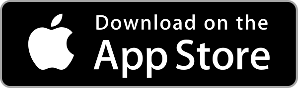](https://apps.apple.com/us/app/dark-light-for-webpages/id6781749180)
[](https://chromewebstore.google.com/detail/dark-light/jmckaadolajjpcmlciacmdenlfkolnhf)
[](https://addons.mozilla.org/zh-CN/firefox/addon/dark-light-web-mode/)

## Screenshots

### Safari (iOS / iPadOS)

| Popup | Rules Manager | App Setup |
|-------|---------------|-----------|
| 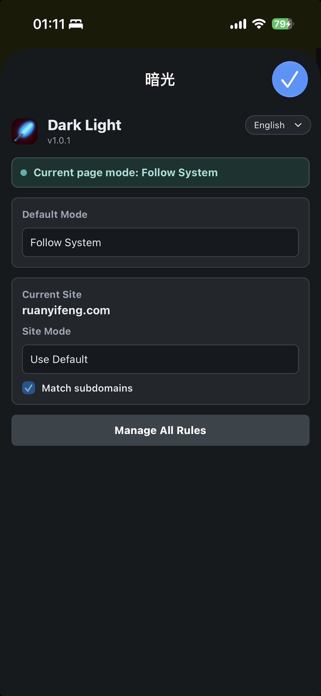 | 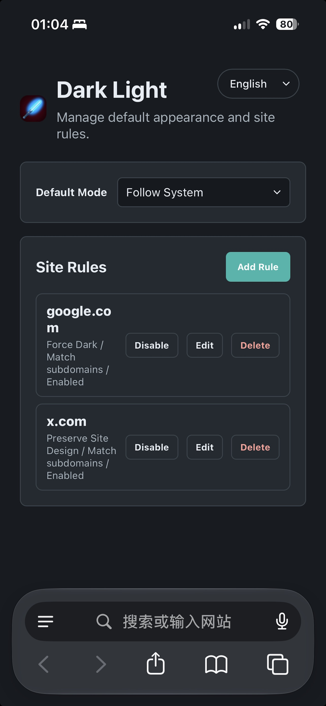 | 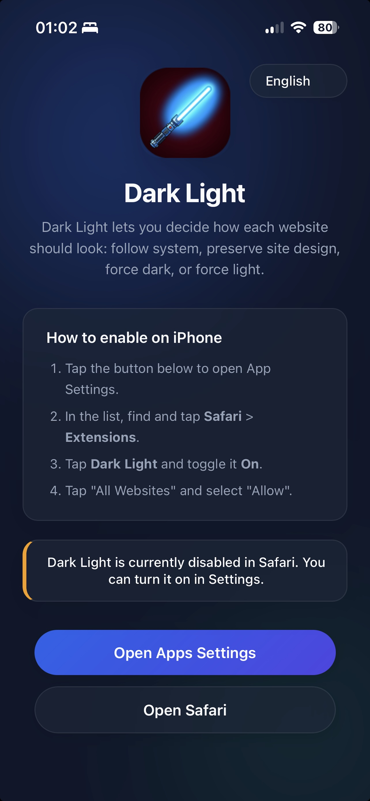 |

| iPad App |
|----------|
| 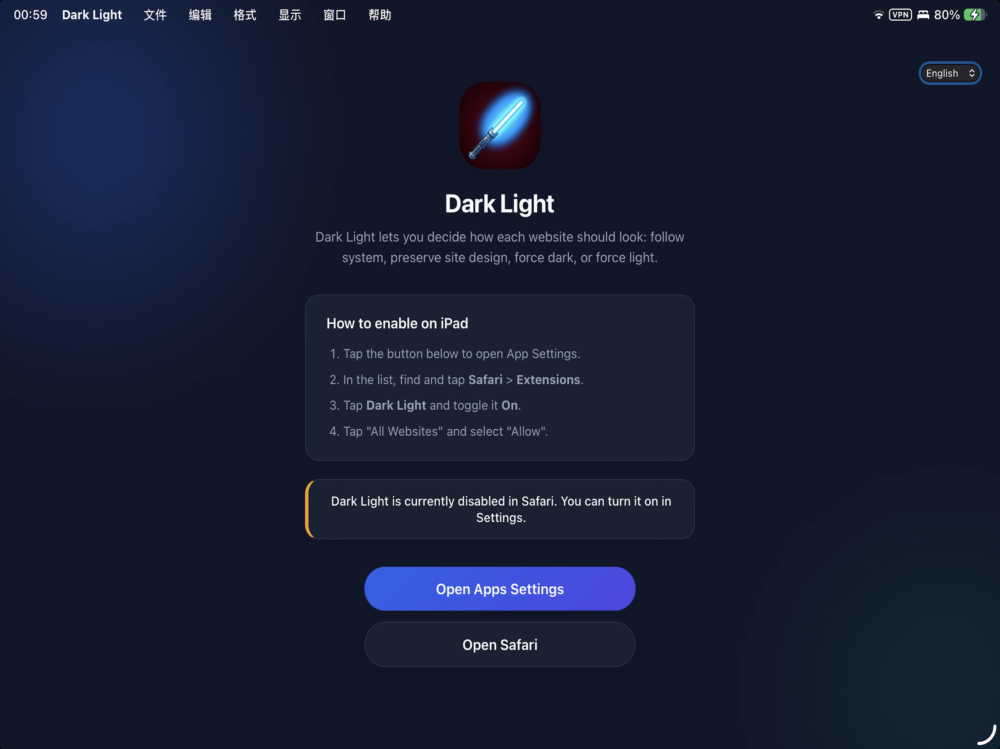 |

### Chrome

| Popup (compact) | Popup (wide) | Options Page |
|-----------------|--------------|--------------|
| 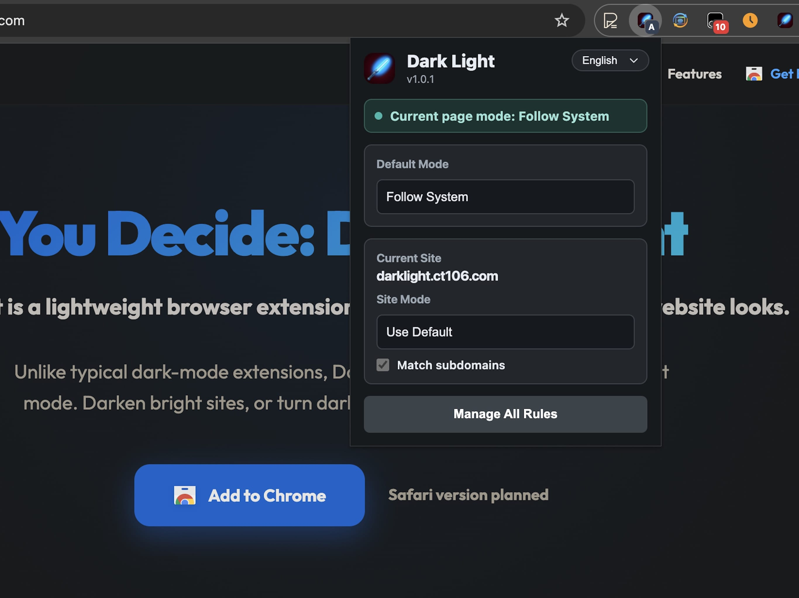 | 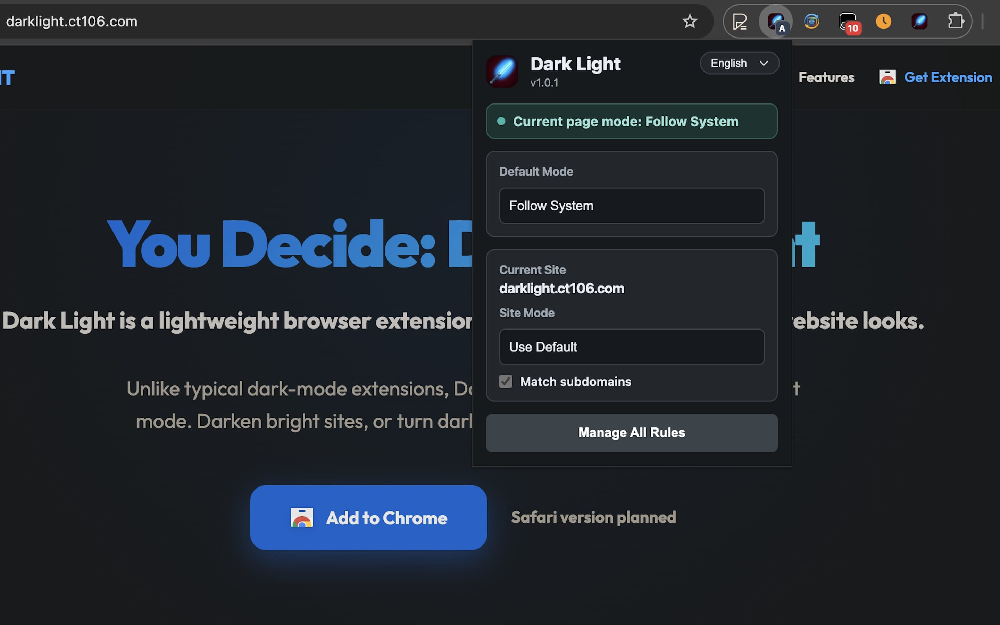 | 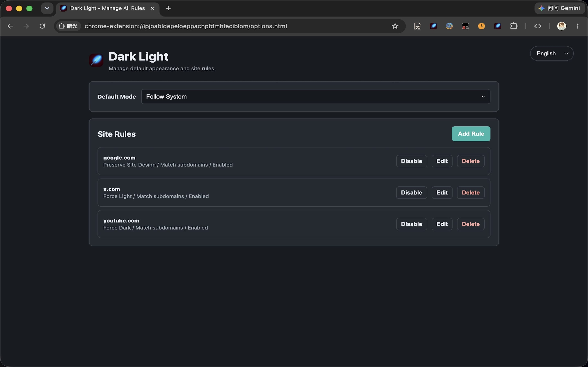 |

| Options Page (full) |
|---------------------|
| 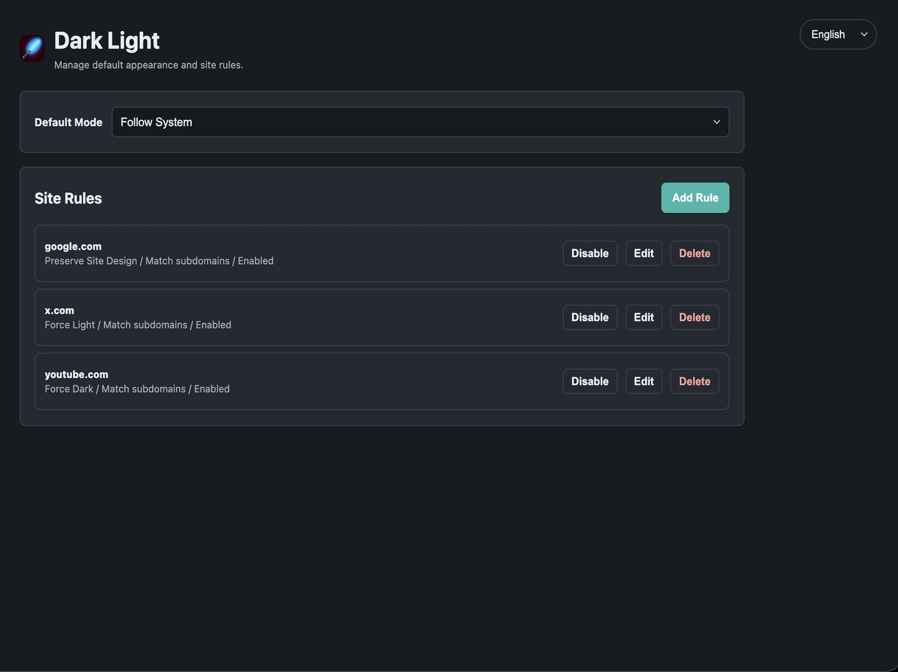 |

### In Action

| Force Dark | Force Light |
|------------|-------------|
| 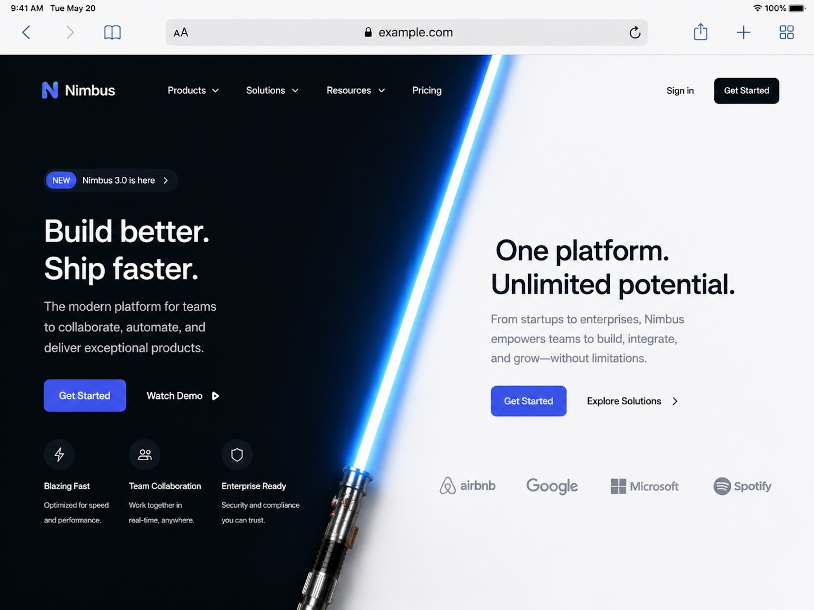 | 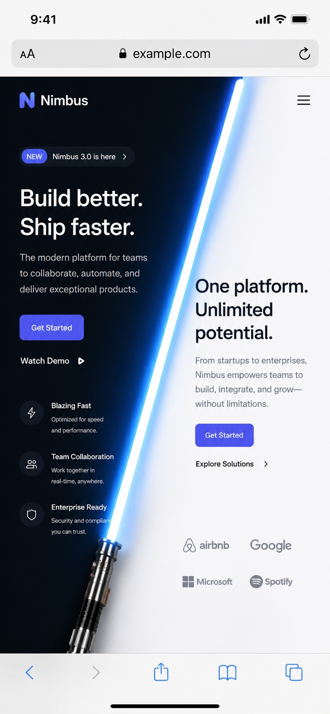 |


### Chrome Extension (Developer Mode)

1. Clone or download this repository.
2. Open Chrome and go to `chrome://extensions/`.
3. Enable **Developer mode**.
4. Click **Load unpacked**.
5. Select the `extension` directory.

### Safari App (Xcode)

1. Open `safari/Dark Light/Dark Light.xcodeproj` in Xcode.
2. Select the `Dark Light` scheme and run it on `My Mac`, or select `Dark Light iOS` to run it on iPhone or iPad (iOS 15+).
3. The host app provides Safari extension setup and, on macOS, App Theme Control for apps without automatic light and dark themes.
4. Enable `Dark Light` in Safari to use website controls, or open **App Theme Control** to configure selected Mac apps without automatic light and dark themes.

### App Theme Control (macOS, Experimental)

The included macOS app can apply a display theme to selected applications that do not automatically adapt to light and dark appearance. Open **App Theme Control** from Dark Light, grant macOS Screen Recording permission, then add an app and choose **Follow System**, **Force Dark**, **Force Light**, or a time-based schedule. The rule automatically applies to all visible windows of that app.

This feature requires macOS 12.3 or later. Dark Light uses the permission only to transform the selected app's on-screen appearance; it does not save or upload screen contents.

The userscript distribution is no longer maintained.

## Technical Details

Dark Light stores website settings in `chrome.storage.sync` under `darkLightSettings`. The macOS host app stores selected app rules and schedules locally in `UserDefaults`.

Force Dark is powered by the vendored `darkreader` package (`extension/vendor/darkreader/`), which is MIT licensed.

The current schema is:

```ts
type ConfiguredMode = 'followSystem' | 'preserveSite' | 'forceDark' | 'forceLight';

type SiteRule = {
  id: string;
  pattern: string;
  mode: ConfiguredMode;
  enabled: boolean;
  matchSubdomains: boolean;
};

type Settings = {
  version: 2;
  defaultMode: ConfiguredMode;
  siteRules: SiteRule[];
};
```

The content script resolves the matching rule, converts `followSystem` into the active system appearance, preserves the page untouched for `preserveSite`, or runs the Force Dark / Force Light strategy.

Permissions used:

- `storage`: Save default mode and site rules.
- `activeTab`: Read the current tab in the popup.
- `<all_urls>` content script: Apply appearance rules on matching pages.

## Privacy

Dark Light does not collect or transmit personal data, browsing history, keystrokes, page content, or screen contents. It sends anonymous launch and host-app daily check-in events to Aptabase, limited to locale, platform, OS, app version, and debug status.
