# 暗光

**网页外观由你决定：一个扩展同时支持深色和浅色。**

[English](./README.md) | **简体中文**

---

暗光是一个轻量浏览器扩展，提供网页外观的双向控制。和常见只支持深色模式的插件不同，暗光不仅能将刺眼的亮色网站强制变深，还能提供可靠的强制浅色模式，让深色站点也变回浅色，让你完全掌控自己的阅读环境。

## 为什么使用暗光?

* **真正的双向控制：** 不只支持强制深色，也支持强制浅色，亮色网站能变深，深色网站也能恢复浅色，完美适配不同的阅读环境。
* **尊重你的真实偏好：** 默认模式支持跟随系统外观、维持网站设计、强制深色、强制浅色。
* **每个网站独立规则：** 任意域名都可以单独设置模式，并可选择是否匹配子域名。
* **更好用的深色模式：** 能把浅色站点稳定转成更舒适的深色阅读体验。
* **可靠的浅色模式：** 也能把深色站点切回浅色，适合白天阅读或强光环境。
* **本地且隐私友好：** 设置和样式处理都只发生在浏览器本地。

## 核心功能

* **全局默认模式：** 跟随系统外观、维持网站设计、强制深色、强制浅色。
* **当前网站快速控制：** 在弹出窗口里直接修改当前域名规则。
* **规则管理页面：** 集中新增、编辑、停用和删除全部网站规则。
* **工具栏状态反馈：** 当前标签页会显示 `A`（跟随系统）、`🌙`（强制深色）、`☀️`（强制浅色）；维持网站设计时不显示角标。
* **已包含 Safari App：** 仓库内已提供原生 macOS 宿主 App 和 Safari Web Extension 工程，位于 `safari/`。

## 安装方法

[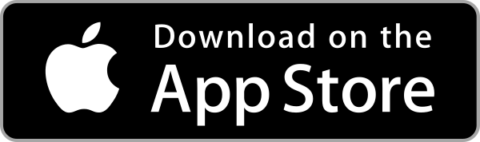](https://apps.apple.com/us/app/dark-light-for-webpages/id6781749180)
[](https://chromewebstore.google.com/detail/dark-light/jmckaadolajjpcmlciacmdenlfkolnhf)
[](https://addons.mozilla.org/zh-CN/firefox/addon/dark-light-web-mode/)

## 截图预览

### Safari（iOS / iPadOS）

| 弹出面板 | 规则管理页 | App 设置引导 |
|---------|-----------|-------------|
| 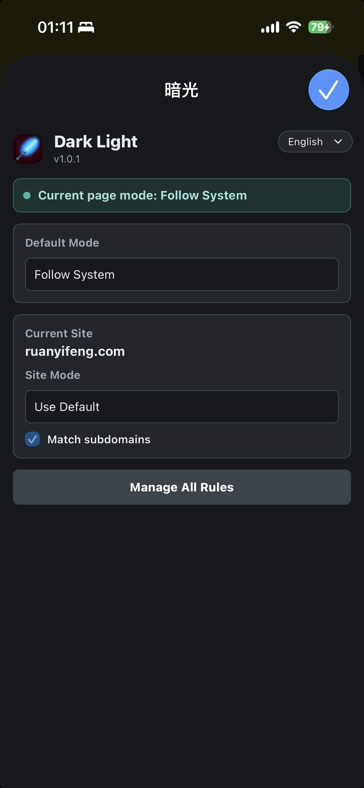 | 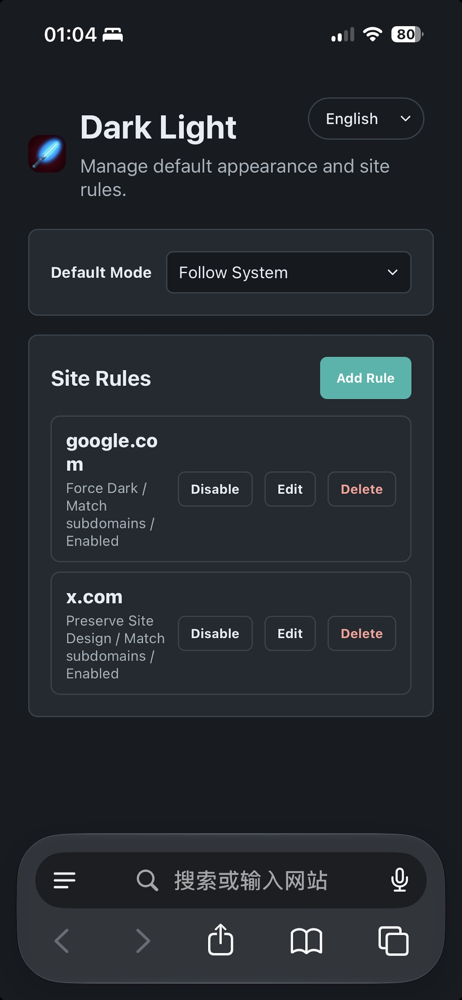 | 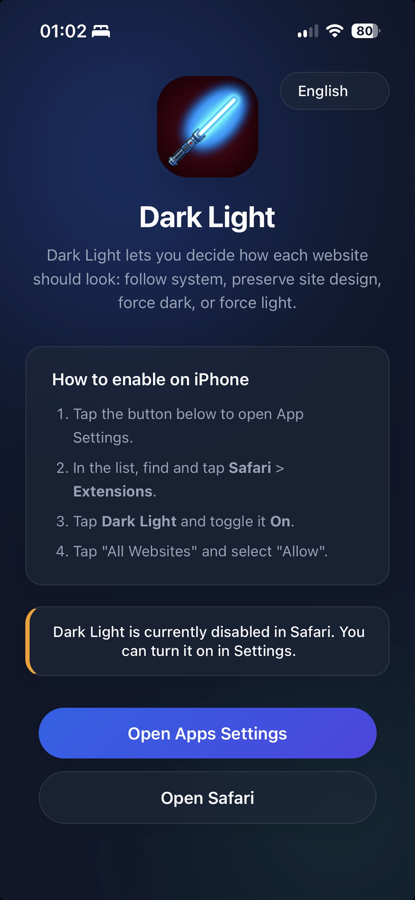 |

| iPad App |
|----------|
| 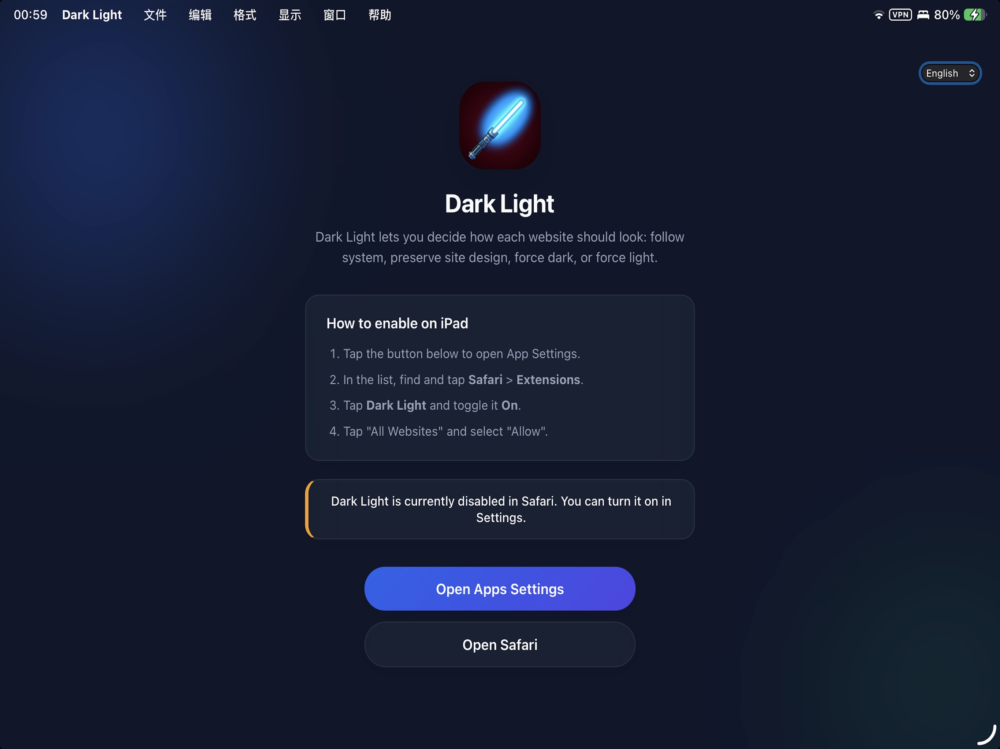 |

### Chrome

| 弹出面板（小视口） | 弹出面板（大视口） | 选项页 |
|-------------------|-------------------|-------|
| 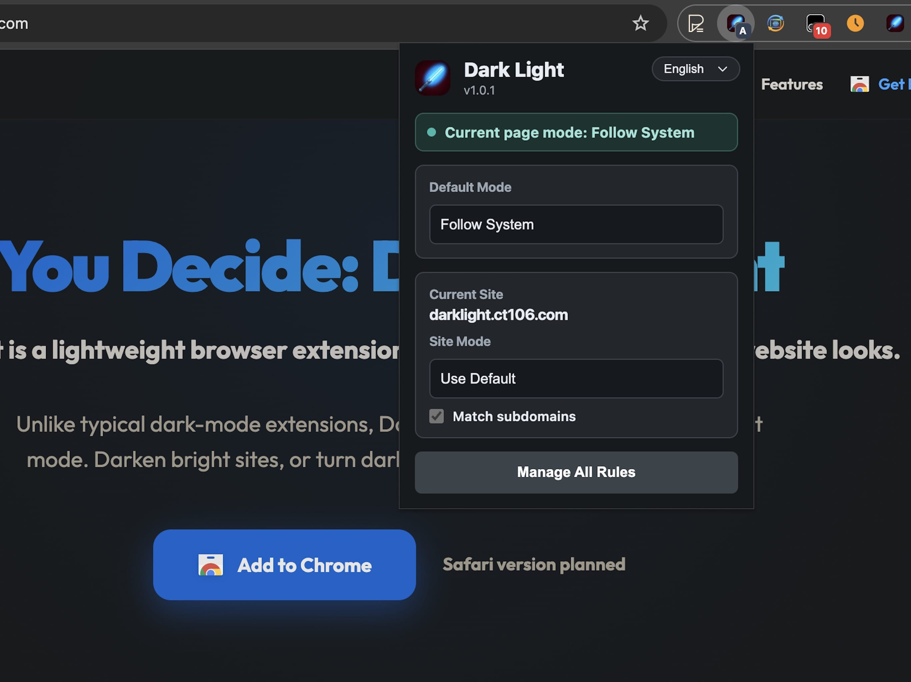 | 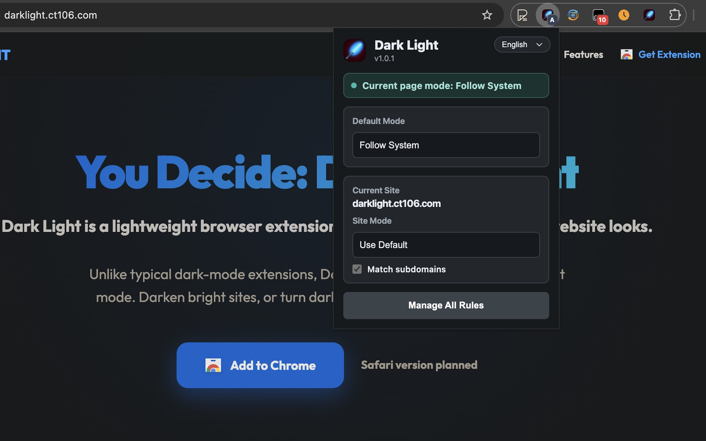 | 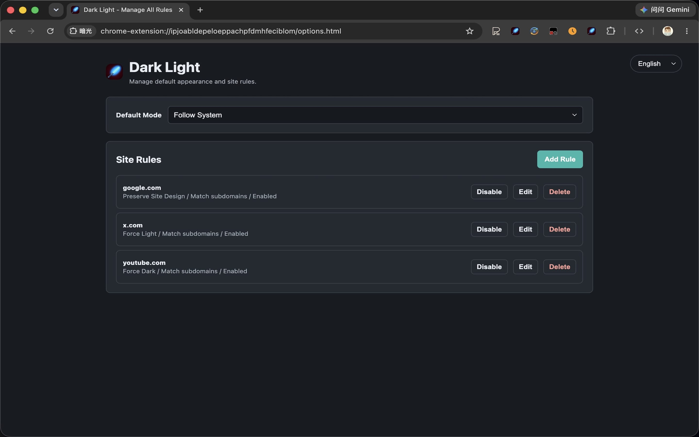 |

| 选项页（完整桌面视图） |
|----------------------|
| 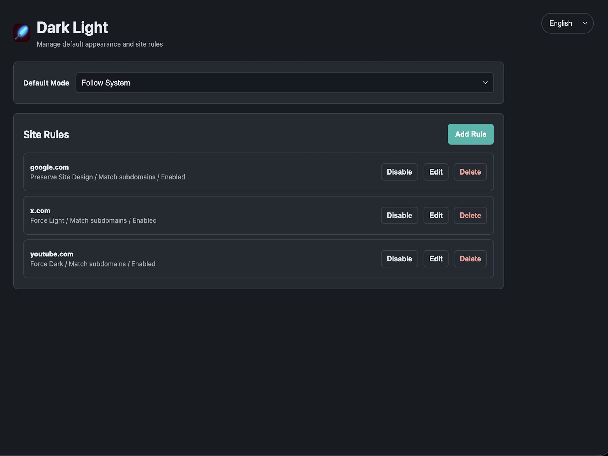 |

### 实际效果

| 强制深色 | 强制浅色 |
|---------|----------|
| 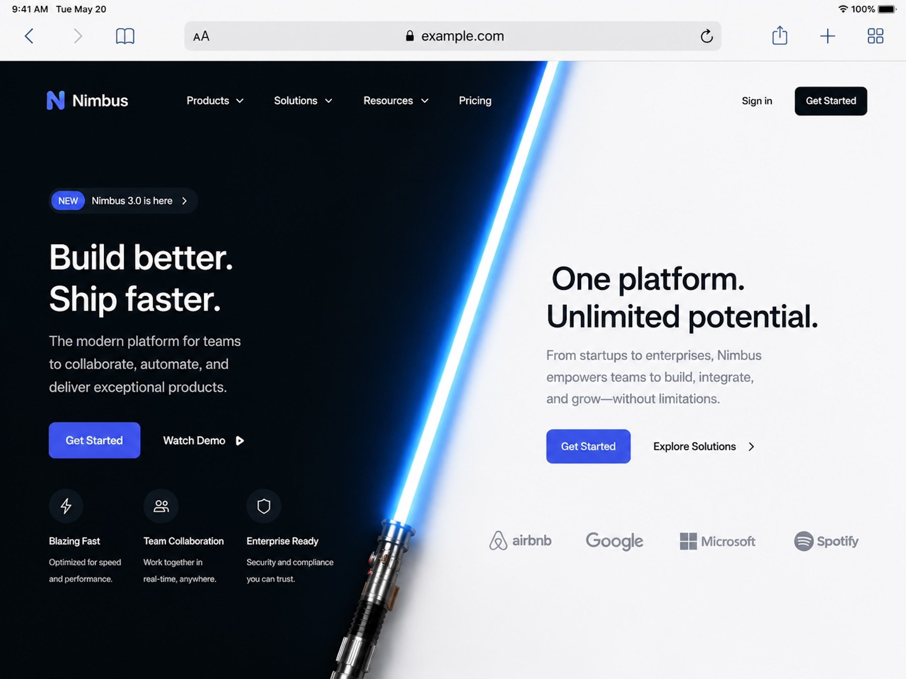 | 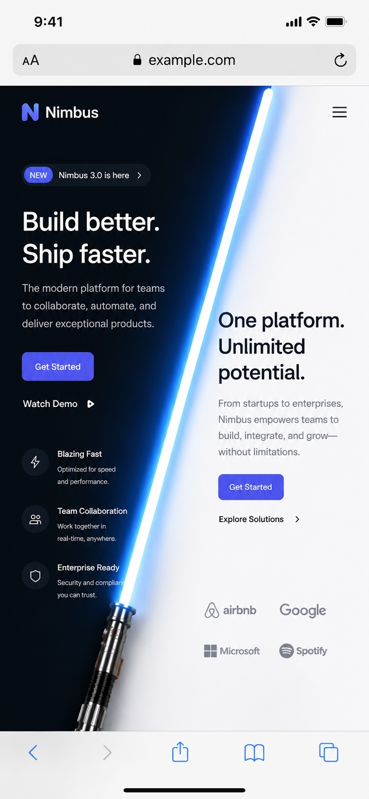 |


### Chrome 扩展程序（开发者模式）

1. 克隆或下载本仓库到本地。
2. 打开 Chrome，进入 `chrome://extensions/`。
3. 开启 **开发者模式**。
4. 点击 **加载已解压的扩展程序**。
5. 选择本项目中的 `extension` 目录。

### Safari App（Xcode）

1. 用 Xcode 打开 `safari/Dark Light/Dark Light.xcodeproj`。
2. macOS 选择 `Dark Light` scheme 并在 `My Mac` 上运行；iPhone 和 iPad（iOS 15+）选择 `Dark Light iOS` scheme。
3. 启动后会出现一个简单介绍窗口，提供“打开 Safari”和“打开 Safari 扩展设置”的按钮。
4. 在 Safari 中启用 `Dark Light` 后，就可以正常使用工具栏弹窗和站点规则。

用户脚本版本不再维护。

## 技术细节

暗光使用 `chrome.storage.sync` 保存 `darkLightSettings`。

强制深色由内置的 `darkreader` 包提供能力，代码位于 `extension/vendor/darkreader/`，许可证为 MIT。

当前配置结构：

```ts
type ConfiguredMode = 'followSystem' | 'preserveSite' | 'forceDark' | 'forceLight';

type SiteRule = {
  id: string;
  pattern: string;
  mode: ConfiguredMode;
  enabled: boolean;
  matchSubdomains: boolean;
};

type Settings = {
  version: 2;
  defaultMode: ConfiguredMode;
  siteRules: SiteRule[];
};
```

内容脚本会先解析当前域名命中的规则，再把 `followSystem` 转换成当前系统实际外观；`preserveSite` 会清除本扩展注入的外观改动并维持网站自己的设计；其他模式会运行强制深色或强制浅色策略。

使用权限：

- `storage`: 保存默认模式和网站规则。
- `activeTab`: 让弹出窗口读取当前标签页。
- `<all_urls>` 内容脚本: 在匹配页面应用外观规则。

## 隐私声明

暗光不收集、不追踪、不传输个人数据、浏览历史、按键记录或网页内容。所有处理都在你的浏览器本地完成。
